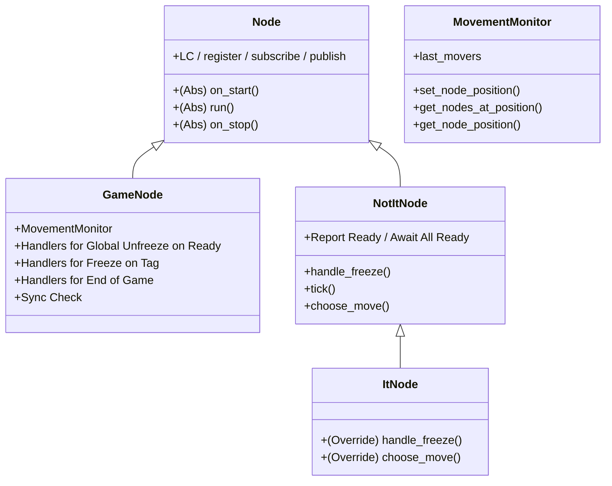

## Quickstart:

Run and Build with Docker:

```bash
docker build -t pivot-robotics-challenge .
docker run -it --rm pivot-robotics-challenge --width 10 --height 10 --num-not-it 4 --positions 3 3 4 4 1 2 2 1 8 8
```

Run with Python:  (Tested on 3.12)
```bash
pip install -r requirements.txt
python game.py --width 10 --height 10 --num-not-it 4 --positions 3 3 4 4 1 2 2 1 8 8
```

Run Unit Tests:
```bash
python -m unittest tests.test_movement_monitor
python -m unittest tests.test_nodes
```

## File Overview:

- `game.py`: Responsible for spinning up the different nodes and waiting their completion.  Parses CLI.
- `gamenode.py`: Main Game Loop, authoritative server, and TUI. Waits for all nodes to spin up before doing a global unpause. Handles freezing nodes and game over.
- `notitnote.py`: Base "mover" node. Reports successful init. Moves randomly. Listens for freeze commands.
- `itnode.py`: Subclasses NotItNode, replacing random moves with purposeful ones. Listens for freeze commands so it knows which nodes are tagged.
- `channels.py`: Simple Enum to prevent stringly-typed errors.
- `movement_monitor.py`: Subscribes to move commands and tracks positions. Used by gamenode to track tags. Used by itnode to seek untagged.

## Class Hierarchy:



## Considerations:

### Q: Why Not Make NotItNode a subclass of GameNode?
It would make sense on some level.  The ItNode is a subclass of the NotItNode and needs to know the position of other nodes, the state of the current game, etc, so it wouldn't be beyond the pale for this kind of inheritance.
The motivation behind keeping them separate is the UI and gameplay elements.  Making the GameNode a parent of NotIt and It would mean adding position info to the GameNode and other handlers, and it seemed less clean.

### Q: Why add a sync method to the GameNode and a sync message?
This wasn't strictly necessary.  It was mostly done to monitor if any messages got dropped unexpectedly.  With proper LCM monitoring this isn't required.

### Q: What about latency handling between the GameNode and player nodes?
This could stand to be improved. There's no latency compensation, rewinding, or replay.  We could monitor how long it takes a round trip packet and compensate for latency, but it would make the code messier.

# Original Readme: Distributed Freeze Tag Game Challenge
This coding challenge involves implementing a distributed real-time Freeze Tag game using multiple agents that communicate over a network. One agent is designated as "It" and the rest are "NotIt" agents. The "It" agent's goal is to chase and freeze all "NotIt" agents. This challenge evaluates your ability to write clean, well-structured code and your understanding of distributed system concepts such as message passing and coordination across nodes.
What You Will Build: A Python-based simulation of Freeze Tag with distributed agents communicating via a publish/subscribe mechanism using LCM (Lightweight Communications and Marshalling). The game continues until all "NotIt" agents have been frozen by the "It" agent.

## Skills Assessed:
Clean coding practices (readability, modularity, proper resource management)
Distributed systems fundamentals (concurrent agents, network communication, coordination)

## Implementation Details
You will use LCM for communication between agents. We provide boilerplate code (node.py) to help structure your implementation. Based on this, you will implement the following nodes in the system, which inherit the Node class from node.py:

## Components
1. GameNode 
  - Listens to position updates from It and NotIt nodes. Keeps track of the global states in a NxM board.
  - If the It node and NotIt node are in the same square, send a message to the NotIt node to freeze. 
  - Visually represents the game state using a simple GUI.
  - Keep track of the number of NotIt nodes which have been frozen. If all NotIt nodes are frozen, then end the game. 
2. NotItNode
  - Waits for synchronization confirmation before starting.
  - Make a random move within the board boundaries every second. Publish the chosen move to the GameNode. 
  - Stop moving immediately upon receiving a freeze message.
3. ItNode
  - Waits for synchronization confirmation before starting.
  - Listen to move updates from all NotIt nodes and keep track of the global state. 
  - Choose a move strategically, chasing NotIt nodes using any simple heuristic/algorithm of your choice.
  - Publish move updates to GameNode every 0.5 seconds.

To ensure fair and synchronized gameplay, implement logic to guarantee that all nodes have successfully started and confirmed readiness via LCM before gameplay begins. Agents must only start moving after synchronization confirmation is received.

## Game Initialization
The simulation should run using the command-line arguments:

`python game.py --width N --height M --num-not-it P --positions x1 y1 x2 y2 ... x_it y_it`

Example:

`python game.py --width 20 --height 15 --num-not-it 2 3 5 10 12 0 0`

(Initializes a 20x15 board with two "NotIt" agents at (3,5), (10,12), and one "It" agent at (0,0))

To coordinate launching and shutdown of the nodes, we share game.py which has some boilerplate code showing how to coordinate the launch and shutdown of a node. Please fill that in to enable the simulation to launch according to the interface defined above. Make sure that on exit all the nodes exit correctly and all resources are correctly released.

## Dockerization
Your solution must be containerized using Docker:
- Provide a Dockerfile specifying all dependencies and necessary setup instructions.
- Ensure your simulation can be executed seamlessly within the Docker container.
- Clearly document Docker commands to build and run your solution.
Example:
`docker build -t freeze-tag .`
`docker run -it --rm freeze-tag --width 20 --height 15 --num-not-it 2 3 5 10 12 0 0`

## Testing and Submission
- Ensure each node type (GameNode, "It", and "NotIt") runs concurrently on a single machine.
- Submit complete Python source code, Dockerfile and a README on how to run the simulation.

## Technical Requirements
- Language: Python
- Communication: Use LCM for messaging via a publish/subscribe model, node.py has boilerplate code to get you started. 
- All agents run concurrently as separate processes on a single machine.
- Clear, structured, and modular Python code.
- Graceful shutdown upon receiving a game-over message or termination signals with no hanging processes. 
## Challenge Guidelines
- For any questions or clarifications, please feel free to email at siddharth@pivotrobotics.com. 
- The use of any and all internet resources (including AI tools) is allowed and even encouraged for this challenge. 
